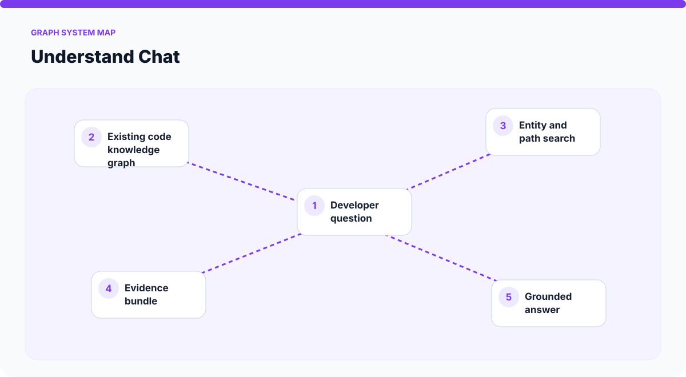
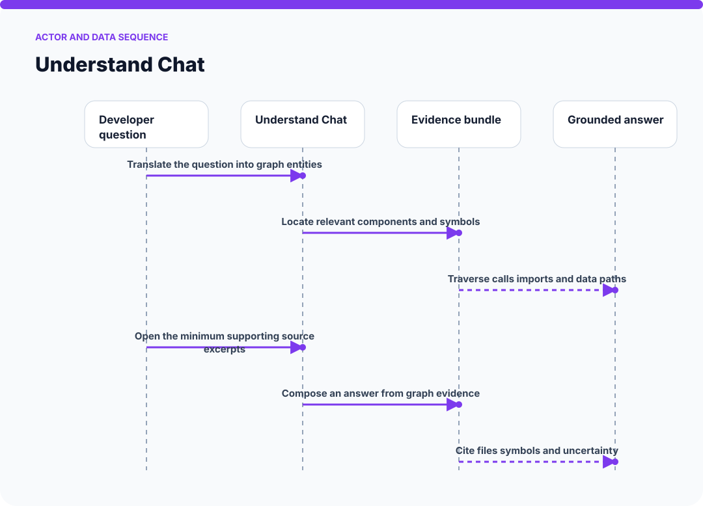
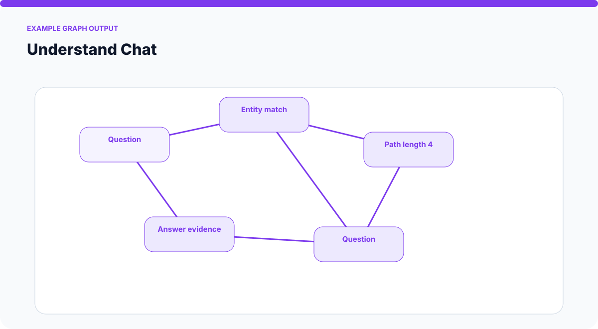
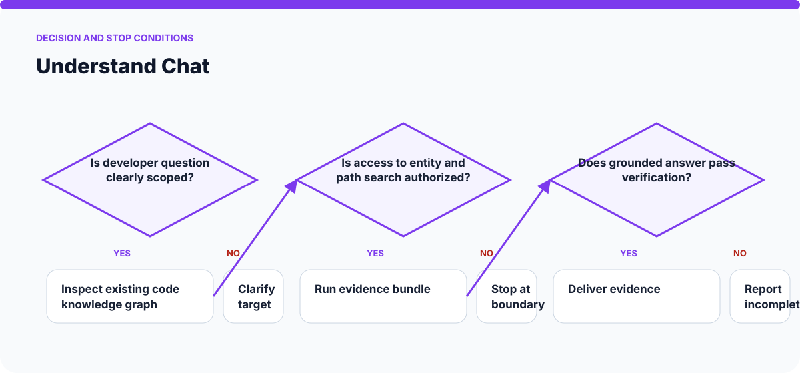

# How Understand Chat Works

The visuals on this page are static SVGs, so they render directly on GitHub on phones and desktop browsers. Each one is generated from a model specific to this skill.

## System architecture

### Components

- **1. Developer question:** participates in translate the question into graph entities.
- **2. Existing code knowledge graph:** participates in locate relevant components and symbols.
- **3. Entity and path search:** participates in traverse calls imports and data paths.
- **4. Evidence bundle:** participates in open the minimum supporting source excerpts.
- **5. Grounded answer:** participates in compose an answer from graph evidence.

## Actor and data sequence

### 1. Translate the question into graph entities

**Primary surface:** `Developer question`

Record the concrete input, the operation performed, and the evidence produced at this stage. Continue only when the output is sufficient for the next stage; otherwise preserve the blocker and stop.
### 2. Locate relevant components and symbols

**Primary surface:** `Existing code knowledge graph`

Record the concrete input, the operation performed, and the evidence produced at this stage. Continue only when the output is sufficient for the next stage; otherwise preserve the blocker and stop.
### 3. Traverse calls imports and data paths

**Primary surface:** `Entity and path search`

Record the concrete input, the operation performed, and the evidence produced at this stage. Continue only when the output is sufficient for the next stage; otherwise preserve the blocker and stop.
### 4. Open the minimum supporting source excerpts

**Primary surface:** `Evidence bundle`

Record the concrete input, the operation performed, and the evidence produced at this stage. Continue only when the output is sufficient for the next stage; otherwise preserve the blocker and stop.
### 5. Compose an answer from graph evidence

**Primary surface:** `Grounded answer`

Record the concrete input, the operation performed, and the evidence produced at this stage. Continue only when the output is sufficient for the next stage; otherwise preserve the blocker and stop.
### 6. Cite files symbols and uncertainty

**Primary surface:** `Developer question`

Record the concrete input, the operation performed, and the evidence produced at this stage. Continue only when the output is sufficient for the next stage; otherwise preserve the blocker and stop.

## Example output shape

The example is a visual contract: a real run may look different, but it should expose comparable state, provenance, and verification information. It is not presented as evidence of a live external action.

## Decision and stop conditions

The workflow stops when the target is ambiguous, the relevant surface is unavailable or unauthorized, or the final artifact cannot be checked. A logged-in session or successful tool call is not by itself proof that the requested outcome is complete.

## Verification checklist

- Confirm every component shown in the system map exists in the target environment.
- Trace the actor sequence using actual tool output or artifact state.
- Compare the result with the example-output information contract.
- Re-read or reopen the final artifact instead of trusting an attempt message.
- Report omitted stages, unsupported capabilities, and remaining human decisions.
